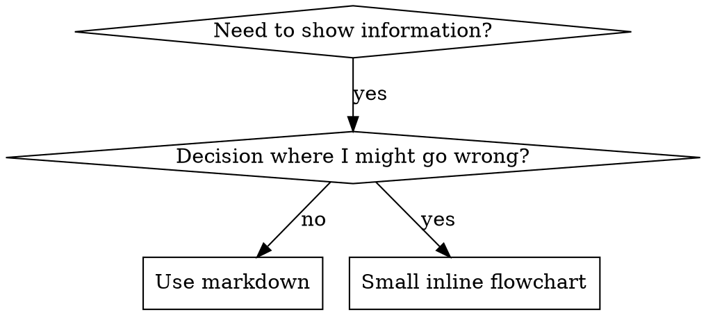

---
name: 技能写作
description: 在创建新 skill、编辑已有 skill，或在部署前验证 skill 是否有效时使用
author: 元木
source: original
created: 2026-06-29
updated: 2026-06-29
---

# 编写 Skill

## 概览

**编写 skill 就是把 TDD（测试驱动开发）应用到流程文档上。**

**个人 skill 存放在各 agent 专属目录下（Claude Code 用 `~/.claude/skills`，Codex 用 `~/.agents/skills/`）**

你写测试用例（用 subagent 跑压力场景），看着它们失败（基线行为），再写 skill（文档），看着测试通过（agent 遵守），然后重构（堵住漏洞）。

**核心原则：** 如果你没有亲眼看到 agent 在没有 skill 的情况下失败，你就不知道这个 skill 教的是不是正确的东西。

**前置知识：** 使用本 skill 之前，你必须理解 superpowers:test-driven-development。那个 skill 定义了基本的 RED-GREEN-REFACTOR 循环。本 skill 把 TDD 适配到文档场景。

**官方指引：** 关于 Anthropic 官方的 skill 编写最佳实践，请参见 anthropic-best-practices.md。本文档提供了补充的模式与指南，与本 skill 中以 TDD 为核心的思路互相配合。

## 什么是 Skill？

**skill** 是针对成熟技巧、模式或工具的参考指南。skill 帮助未来的 Claude 实例找到并应用有效的方法。

**Skill 是：** 可复用的技巧、模式、工具、参考指南

**Skill 不是：** 讲述你某次怎么解决问题的故事

## TDD 与 Skill 编写的对应关系

| TDD 概念 | Skill 编写 |
|-------------|----------------|
| **测试用例** | 用 subagent 跑压力场景 |
| **生产代码** | Skill 文档（SKILL.md） |
| **测试失败（RED）** | 没有 skill 时 agent 违反规则（基线） |
| **测试通过（GREEN）** | 引入 skill 后 agent 遵守 |
| **重构** | 在保持合规的前提下堵住漏洞 |
| **先写测试** | 在写 skill 之前先跑基线场景 |
| **看着测试失败** | 记录 agent 用过的具体借口 |
| **最小代码** | 针对那些具体违规写 skill |
| **看着测试通过** | 验证 agent 现在守规矩了 |
| **重构循环** | 发现新借口 → 堵住 → 重新验证 |

整个 skill 创建过程都遵循 RED-GREEN-REFACTOR。

## 什么时候应该创建 Skill

**应当创建的情况：**
- 这个技巧对你来说不是显而易见的
- 你会在多个项目中再次用到它
- 模式具有广泛适用性（不是某个项目独有的）
- 其他人也会受益

**不要创建的情况：**
- 一次性的解决方案
- 已有充分文档的标准实践
- 项目专属约定（放到 CLAUDE.md 里）
- 机械式约束（如果能用正则或校验自动化的，就自动化——把文档留给需要判断的地方）

## Skill 的类型

### 技巧（Technique）
附带具体步骤的方法（条件等待、根本原因追溯等）

### 模式（Pattern）
看待问题的思维方式（用 flag 拍平、测试不变量等）

### 参考（Reference）
API 文档、语法指南、工具文档（官方文档）

## 目录结构


```
skills/
  skill-name/
    SKILL.md              # 主参考文档（必需）
    supporting-file.*     # 视需要添加
```

**扁平命名空间** —— 所有 skill 都在一个可搜索的命名空间下

**应当拆出独立文件的场景：**
1. **重型参考**（超过 100 行）—— API 文档、完整语法
2. **可复用工具** —— 脚本、工具、模板

**应当内联保留的内容：**
- 原则和概念
- 代码模式（少于 50 行）
- 其他所有内容

## SKILL.md 的结构

**前置 matter（YAML）：**
- 只支持两个字段：`name` 和 `description`
- 总长度上限 1024 字符
- `name`：只能使用字母、数字和连字符（不要用括号、特殊字符）
- `description`：第三人称，只描述什么时候使用（而不是它做什么）
  - 以 "Use when..." 开头，聚焦触发条件
  - 包含具体的症状、场景和上下文
  - **绝对不要概述 skill 的流程或工作流**（原因见 CSO 一节）
  - 尽量控制在 500 字符以内

```markdown
---
name: Skill-Name-With-Hyphens
description: Use when [specific triggering conditions and symptoms]
author: 元木
---

# Skill Name

## Overview
这是什么？用 1-2 句话讲清核心原则。

## When to Use
[如果决策不直观，可加一个内联小流程图]

用要点列出症状和适用场景
列出不适用的场景

## Core Pattern（用于技巧/模式）
修改前/后的代码对比

## Quick Reference
表格或要点，用于快速查阅常用操作

## Implementation
简单模式用内联代码
重型参考或可复用工具则链接到文件

## Common Mistakes
哪里会出错 + 修复方法

## Real-World Impact（可选）
具体的效果
```


## Claude 搜索优化（CSO）

**对可发现性至关重要：** 未来的 Claude 需要能找到你的 skill

### 1. 丰富的 description 字段

**目的：** Claude 通过 description 决定在某个任务中应该加载哪些 skill。要让 description 回答："我现在应该读这个 skill 吗？"

**格式：** 以 "Use when..." 开头，聚焦触发条件

**关键：description 描述的是"何时使用"，而不是"skill 做什么"**

description 只能描述触发条件。不要在 description 里概述 skill 的流程或工作流。

**为什么这一点很重要：** 测试发现，如果 description 概述了 skill 的工作流，Claude 可能会照着 description 走，而不去读 skill 完整内容。一条 "code review between tasks"（任务之间做代码评审）的 description 让 Claude 只做了一次评审，但 skill 的流程图明明清楚显示要做两次（先核对需求，再看代码质量）。

把 description 改成单纯的 "Use when executing implementation plans with independent tasks"（没有任何工作流概述）之后，Claude 才会正确读取流程图，遵循两段式评审流程。

**陷阱：** 概述工作流的 description 会让 Claude 抄近路。skill 主体反而变成了 Claude 跳过的文档。

```yaml
# ❌ 不好：概述了工作流 - Claude 可能照抄而不去读 skill
description: Use when executing plans - dispatches subagent per task with code review between tasks

# ❌ 不好：流程细节太多
description: Use for TDD - write test first, watch it fail, write minimal code, refactor

# ✅ 好：只写触发条件，不概述工作流
description: Use when executing implementation plans with independent tasks in the current session

# ✅ 好：只写触发条件
description: Use when implementing any feature or bugfix, before writing implementation code
```

**内容：**
- 使用具体的触发点、症状和场景，来表达该 skill 适用
- 描述*问题本身*（竞态条件、行为不一致），而不是*语言层面的症状*（setTimeout、sleep）
- 触发条件尽量与技术无关，除非 skill 本身就是技术专属的
- 如果 skill 是技术专属的，要在触发条件中明确写出
- 用第三人称写（会被注入到系统提示中）
- **绝对不要概述 skill 的流程或工作流**

```yaml
# ❌ 不好：太抽象、太含糊、没有写什么时候用
description: For async testing

# ❌ 不好：第一人称
description: I can help you with async tests when they're flaky

# ❌ 不好：提到了技术，但 skill 本身不是该技术专属
description: Use when tests use setTimeout/sleep and are flaky

# ✅ 好：以 "Use when" 开头，描述问题，不写工作流
description: Use when tests have race conditions, timing dependencies, or pass/fail inconsistently

# ✅ 好：技术专属的 skill 写出明确触发条件
description: Use when using React Router and handling authentication redirects
```

### 2. 关键词覆盖

使用 Claude 会去搜的词：
- 错误信息："Hook timed out"、"ENOTEMPTY"、"race condition"
- 症状："flaky"、"hanging"、"zombie"、"pollution"
- 同义词："timeout/hang/freeze"、"cleanup/teardown/afterEach"
- 工具：实际命令、库名、文件类型

### 3. 描述性的命名

**使用主动语态，动词优先：**
- ✅ `creating-skills`，不要 `skill-creation`
- ✅ `condition-based-waiting`，不要 `async-test-helpers`

### 4. Token 效率（关键）

**问题：** getting-started 和高频引用的 skill 会加载到每一次会话中。每一个 token 都很宝贵。

**目标字数：**
- getting-started 工作流：每个 <150 词
- 高频加载的 skill：总计 <200 词
- 其他 skill：<500 词（保持简洁）

**常用技巧：**

**把细节移到工具自身的帮助里：**
```bash
# ❌ 不好：在 SKILL.md 中把所有 flag 都列出来
search-conversations supports --text, --both, --after DATE, --before DATE, --limit N

# ✅ 好：直接引用 --help
search-conversations supports multiple modes and filters. Run --help for details.
```

**使用交叉引用：**
```markdown
# ❌ 不好：重复工作流细节
When searching, dispatch subagent with template...
[重复 20 行指令]

# ✅ 好：引用其他 skill
Always use subagents (50-100x context savings). REQUIRED: Use [other-skill-name] for workflow.
```

**压缩示例：**
```markdown
# ❌ 不好：冗长示例（42 词）
your human partner: "How did we handle authentication errors in React Router before?"
You: I'll search past conversations for React Router authentication patterns.
[Dispatch subagent with search query: "React Router authentication error handling 401"]

# ✅ 好：极简示例（20 词）
Partner: "How did we handle auth errors in React Router?"
You: Searching...
[Dispatch subagent → synthesis]
```

**消除冗余：**
- 不要重复被交叉引用的 skill 里已经写过的内容
- 不要解释命令里显而易见的东西
- 同一模式不要给多个示例

**验证方法：**
```bash
wc -w skills/path/SKILL.md
# getting-started workflows: aim for <150 each
# Other frequently-loaded: aim for <200 total
```

**用"你做什么"或"核心洞见"来命名：**
- ✅ `condition-based-waiting` 优于 `async-test-helpers`
- ✅ `using-skills`，不要 `skill-usage`
- ✅ `flatten-with-flags` 优于 `data-structure-refactoring`
- ✅ `root-cause-tracing` 优于 `debugging-techniques`

**动名词（-ing）很适合用来命名流程：**
- `creating-skills`、`testing-skills`、`debugging-with-logs`
- 主动语态，描述你正在做的事

### 4. 交叉引用其他 Skill

**写引用其他 skill 的文档时：**

只写 skill 名称，并明确标注"必需"：
- ✅ 好：`**REQUIRED SUB-SKILL:** Use superpowers:test-driven-development`
- ✅ 好：`**REQUIRED BACKGROUND:** You MUST understand superpowers:systematic-debugging`
- ❌ 不好：`See skills/testing/test-driven-development`（看不出是否必需）
- ❌ 不好：`@skills/testing/test-driven-development/SKILL.md`（强制加载，浪费 context）

**为什么不用 @ 链接：** `@` 语法会立刻强制加载文件，在你需要它之前就消耗 200k+ 的 context。

## 流程图的使用



**只在以下情况使用流程图：**
- 不那么明显的决策点
- 可能过早停止的流程循环
- "什么时候用 A，什么时候用 B"的决策

**不要在以下场景使用流程图：**
- 参考材料 → 用表格、列表
- 代码示例 → 用 Markdown 块
- 线性指令 → 用有序列表
- 语义不明的标签（step1、helper2）

Graphviz 样式规则请见 @graphviz-conventions.dot。

**给你的伙伴可视化：** 用本目录下的 `render-graphs.js` 把 skill 里的流程图渲染成 SVG：
```bash
./render-graphs.js ../some-skill           # 每个图单独输出
./render-graphs.js ../some-skill --combine # 所有图合到一个 SVG
```

## 代码示例

**一个极好的示例胜过一堆平庸的示例**

选择最相关的语言：
- 测试技巧 → TypeScript/JavaScript
- 系统调试 → Shell/Python
- 数据处理 → Python

**好示例的特征：**
- 完整可运行
- 注释充分，讲清楚为什么这么做
- 出自真实场景
- 清晰展示模式
- 容易改造（不是泛泛的模板）

**不要：**
- 用 5 种以上语言各实现一遍
- 写填空式模板
- 编造不切实际的示例

你很擅长迁移——一个出色的示例就够了。

## 文件组织

### 自给自足的 Skill
```
defense-in-depth/
  SKILL.md    # 所有内容内联
```
适用：内容能装下，没有重型参考

### 带可复用工具的 Skill
```
condition-based-waiting/
  SKILL.md    # 概览 + 模式
  example.ts  # 可改造的工作代码
```
适用：工具是可复用的代码，而不只是叙述

### 带重型参考的 Skill
```
pptx/
  SKILL.md       # 概览 + 工作流
  pptxgenjs.md   # 600 行 API 参考
  ooxml.md       # 500 行 XML 结构
  scripts/       # 可执行工具
```
适用：参考材料太大无法内联

## 铁律（与 TDD 相同）

```
没有失败的测试，就不许写 skill
```

这条规则既适用于新 skill，也适用于对已有 skill 的修改。

先写 skill 再测试？删掉。从头来。
未测试就改 skill？同样违反。

**没有任何例外：**
- 不能因为"只是小补充"就跳过
- 不能因为"只是加一节"就跳过
- 不能因为"只是文档更新"就跳过
- 不要把没测过的改动当"参考"留下来
- 跑测试时不要"边测边调"
- 删了就是删了

**前置知识：** superpowers:test-driven-development 这个 skill 解释了为什么这一点如此重要。同样的原则也适用于文档。

## 测试所有 Skill 类型

不同类型的 skill 需要不同的测试方法：

### 纪律约束型 Skill（规则/要求）

**示例：** TDD、完成前验证、编码前先设计

**测试方法：**
- 学术问题：它理解这些规则吗？
- 压力场景：它在压力下还能遵守吗？
- 多种压力叠加：时间 + 沉没成本 + 疲惫
- 找出借口，逐条加明确反制

**成功标准：** Agent 在最大压力下仍能遵守规则

### 技巧型 Skill（操作指南）

**示例：** condition-based-waiting、root-cause-tracing、defensive-programming

**测试方法：**
- 应用场景：能正确应用该技巧吗？
- 变体场景：能处理边界情况吗？
- 信息缺失测试：指令里有没有漏洞？

**成功标准：** Agent 在新场景下能成功应用该技巧

### 模式型 Skill（思维模型）

**示例：** reducing-complexity、information-hiding 概念

**测试方法：**
- 识别场景：能识别模式适用时机吗？
- 应用场景：能使用该思维模型吗？
- 反例：知道什么时候不该用吗？

**成功标准：** Agent 能正确判断何时/如何应用该模式

### 参考型 Skill（文档/API）

**示例：** API 文档、命令参考、库使用指南

**测试方法：**
- 检索场景：能查到正确的信息吗？
- 应用场景：能正确使用查到的内容吗？
- 缺口测试：常见用例都覆盖了吗？

**成功标准：** Agent 能查到并正确应用参考信息

## 跳过测试的常见借口

| 借口 | 真相 |
|--------|---------|
| "Skill 显然已经很清楚了" | 你觉得清楚 ≠ 别的 agent 觉得清楚。测一下。 |
| "只是个参考而已" | 参考也可能有缺口、有模糊段落。测一下检索。 |
| "测试太小题大做" | 没测过的 skill 一定有问题。15 分钟的测试能省下几个小时。 |
| "出问题再测" | 问题就意味着 agent 用不了 skill。部署前就要测。 |
| "测试太烦了" | 测一遍的烦，远小于在生产环境调试烂 skill 的烦。 |
| "我有信心它没问题" | 过度自信恰恰保证它会有问题。还是要测。 |
| "学术评审就够了" | 读懂 ≠ 会用。要测实际应用场景。 |
| "没时间测" | 部署没测过的 skill，之后修起来花的时间更多。 |

**以上所有借口的结论都是：部署前先测。没有例外。**

## 让 Skill 抗住"找借口"

强制纪律的 skill（比如 TDD）必须能抗住借口。Agent 很聪明，受压时一定会找漏洞。

**心理学小注：** 理解了说服技巧为什么有效，你就能系统地运用它们。研究基础见 persuasion-principles.md（Cialdini, 2021；Meincke et al., 2025），里面讲了权威、承诺、稀缺、社会认同和一致性原则。

### 明确堵住每一个漏洞

不要只写规则——把具体的绕路方法也禁掉：

<Bad>
```markdown
Write code before test? Delete it.
```
</Bad>

<Good>
```markdown
Write code before test? Delete it. Start over.

**No exceptions:**
- Don't keep it as "reference"
- Don't "adapt" it while writing tests
- Don't look at it
- Delete means delete
```
</Good>

### 应对"精神 vs 字面"的诡辩

在文档开头先写明根本原则：

```markdown
**Violating the letter of the rules is violating the spirit of the rules.**
```

（违反规则的字面，就是违反规则的精神。）

这样就能切断一整类"我是在遵循精神"的借口。

### 构造借口清单

从基线测试中收集借口（见下文的测试一节）。Agent 找的每一个借口都收进表里：

```markdown
| Excuse | Reality |
|--------|---------|
| "Too simple to test" | Simple code breaks. Test takes 30 seconds. |
| "I'll test after" | Tests passing immediately prove nothing. |
| "Tests after achieve same goals" | Tests-after = "what does this do?" Tests-first = "what should this do?" |
```

### 创建红旗清单

方便 Agent 在找借口时能自我检查：

```markdown
## Red Flags - STOP and Start Over

- Code before test
- "I already manually tested it"
- "Tests after achieve the same purpose"
- "It's about spirit not ritual"
- "This is different because..."

**All of these mean: Delete code. Start over with TDD.**
```

### 在 CSO 中加入"违规症状"

在 description 里加上"你即将违规"的症状：

```yaml
description: use when implementing any feature or bugfix, before writing implementation code
```

## Skill 编写的 RED-GREEN-REFACTOR

遵循 TDD 循环：

### RED：写一个失败的测试（基线）

在**没有 skill** 的情况下用 subagent 跑压力场景。逐字记录行为：
- 它做了什么选择？
- 它用了什么借口（逐字记录）？
- 哪些压力触发了违规？

这就是"看着测试失败"——在写 skill 之前，你必须先看到 agent 自然的行为。

### GREEN：写最小化的 Skill

针对那些具体的借口来写 skill。不要为假想情况多写内容。

在**有 skill** 的情况下跑同样的场景。Agent 现在应该能遵守。

### REFACTOR：堵住漏洞

Agent 找到了新借口？加上明确的反制。反复测到无懈可击。

**测试方法：** 完整的测试方法见 @testing-skills-with-subagents.md：
- 怎么写压力场景
- 压力类型（时间、沉没成本、权威、疲惫）
- 系统化地堵漏洞
- 元测试技巧

## 反模式

### ❌ 叙事式示例
"In session 2025-10-03, we found empty projectDir caused..."
**为什么不好：** 太具体，无法复用

### ❌ 多语言稀释
example-js.js、example-py.py、example-go.go
**为什么不好：** 质量平庸，维护负担大

### ❌ 把代码塞进流程图
```dot
step1 [label="import fs"];
step2 [label="read file"];
```
**为什么不好：** 无法复制粘贴，难读

### ❌ 通用标签
helper1、helper2、step3、pattern4
**为什么不好：** 标签应当有语义含义

## 停一下：准备进入下一个 Skill 之前

**写完任何 skill 之后，你必须停下来完成部署流程。**

**不要：**
- 批量创建多个 skill，却一个都不测
- 当前 skill 还没验证就去做下一个
- 因为"批处理更高效"就跳过测试

**下面的部署清单对每个 skill 都是强制要求的。**

部署没测过的 skill = 部署没测过的代码。这违反了质量标准。

## Skill 创建清单（TDD 适配版）

**重要：对下面每个清单项，都用 TodoWrite 创建对应的 todo。**

**RED 阶段 —— 写一个失败的测试：**
- [ ] 构造压力场景（纪律类 skill 需要 3 种以上叠加压力）
- [ ] 在没有 skill 的情况下跑场景 —— 逐字记录基线行为
- [ ] 找出借口/失败的规律

**GREEN 阶段 —— 写最小化的 Skill：**
- [ ] 名字只用字母、数字、连字符（不要括号、特殊字符）
- [ ] YAML frontmatter 只包含 name 和 description（总长 ≤ 1024 字符）
- [ ] description 以 "Use when..." 开头，包含具体的触发条件/症状
- [ ] description 用第三人称写
- [ ] 全文铺好关键词，便于搜索（错误、症状、工具）
- [ ] 清晰的概览，写出核心原则
- [ ] 解决 RED 阶段发现的具体基线失败
- [ ] 代码内联或链接到独立文件
- [ ] 给一个出色的示例（不要多语言）
- [ ] 在有 skill 的情况下跑场景 —— 验证 agent 守规矩

**REFACTOR 阶段 —— 堵住漏洞：**
- [ ] 找出测试中暴露的新借口
- [ ] 加上明确的反制（如果是纪律类 skill）
- [ ] 用所有测试轮次的借口构造借口清单
- [ ] 创建红旗清单
- [ ] 反复测到无懈可击

**质量检查：**
- [ ] 仅在决策不直观时使用小流程图
- [ ] 有快速参考表
- [ ] 有常见错误一节
- [ ] 没有叙事式讲述
- [ ] 仅在工具或重型参考时才拆出辅助文件

**部署：**
- [ ] 提交 skill 到 git 并推送到你的 fork（如已配置）
- [ ] 考虑通过 PR 回流贡献（如具有广泛价值）

## 发现流程

未来的 Claude 怎么找到你的 skill：

1. **遇到问题**（"tests are flaky"）
3. **找到 SKILL**（description 匹配上）
4. **扫一眼概览**（是不是相关？）
5. **读模式**（快速参考表）
6. **加载示例**（仅在实际动手时才需要）

**针对这个流程做优化** —— 尽早、多放可搜索的关键词。

## 相关 skill

- [DiveInto阅读导航](./深度构建 agent/DiveInto阅读导航/SKILL.md) —— 本项目的 Claude Code 深度分析总入口
- [Claude Code架构剖析](./深度构建 agent/Claude Code架构剖析/SKILL.md) —— 理解 skill 运行在 Claude Code 的哪个架构层
- [构建AI智能体决策指南](./深度构建 agent/构建AI智能体决策指南/SKILL.md) —— skill 是 agent 能力扩展，与 agent 设计空间互补
- [技能打磨器](../技能打磨器/SKILL.md) —— 基于 Claude Code 的 skill 质量迭代修复

## 总结

**写 skill 就是给流程文档做 TDD。**

铁律相同：没有失败的测试，就不许写 skill。
循环相同：RED（基线）→ GREEN（写 skill）→ REFACTOR（堵漏洞）。
收益相同：质量更好，惊喜更少，结果无懈可击。

如果你给代码做 TDD，那就给 skill 也做 TDD。同样的纪律，同样用在文档上。
